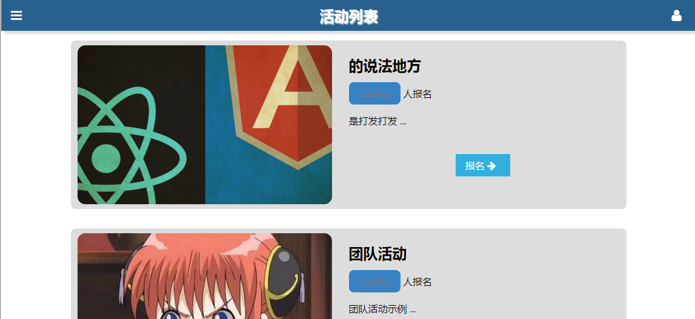
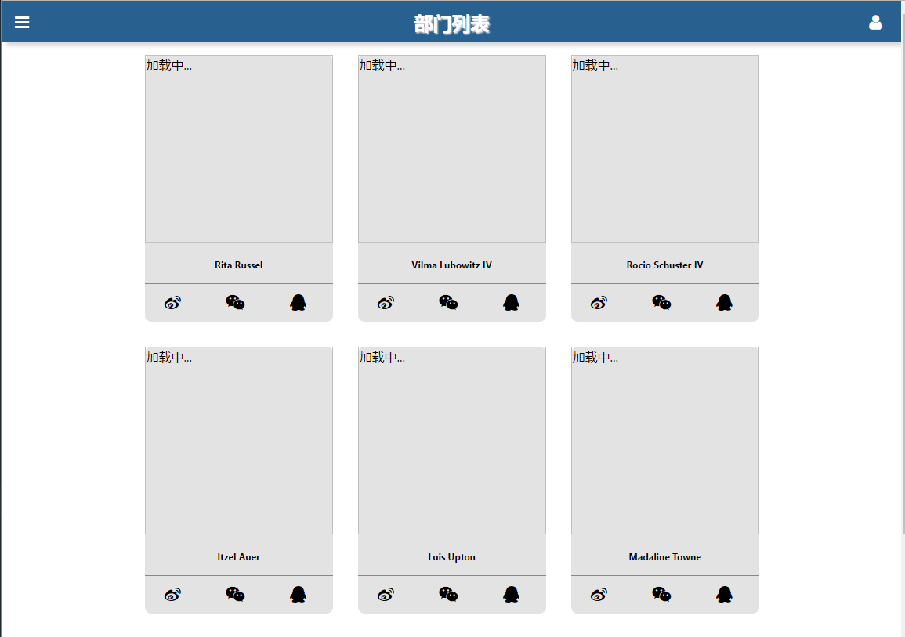
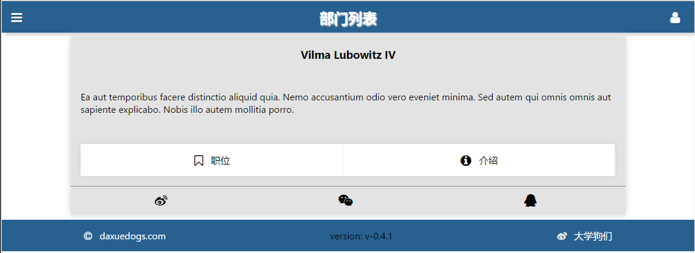
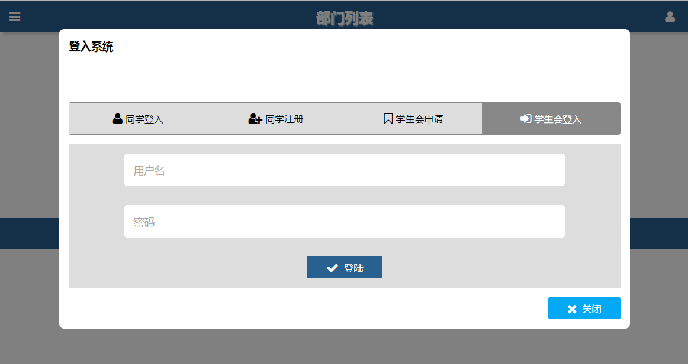
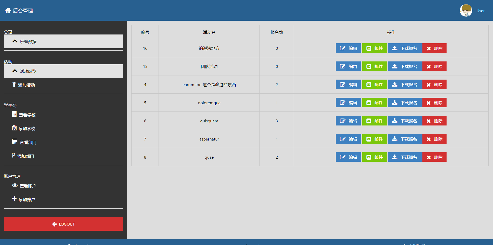
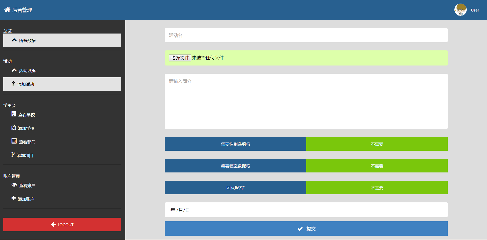
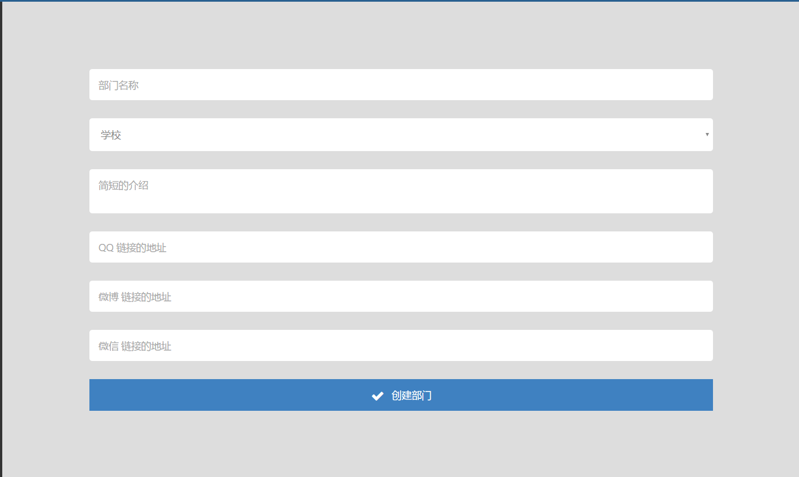
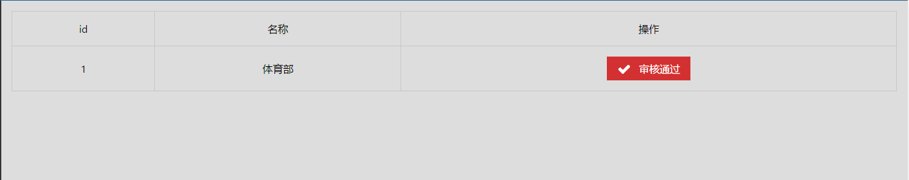

## Summary

这是一个快死了的项目。我对它维护有了半年之久，算是我维护过的最长的项目了，毕竟是个个人做的。

一开是做的时候也没想太多，对自己说做个稍微大点儿的东西练练手吧。

开了坑，哭着也要写。

其实没有启宏我可能早就放弃了, 不能让他觉得我不靠谱对吧。

## Road

第一版那会儿学会了Laravel，直接做了一个服务端渲染的版本。前端随便整了套Bootstrap。然后就上线了。

那个阶段的主要功能是为学生会部门提供一个主页样的东西。有个timeline的东西。自己撸出来了一个。只是太丑了，设计功力确实差。

然后说做活动报名吧，学生会做活动报名确实痛苦，那我们就上了。这个阶段学了React，就准备重构，前面的页面太多了，整理起来真是烦死了。所以推到重构。

果然踩坑了。那个时候还没有React + React-Router + Redux这么成熟的技术栈，然后组件嵌套层次深到没办法弄，怎么办。正好看到尤雨溪在知乎上总是安利，Laracasts里也有课程，Vue的中文文档确实是不错。然后就转写Vue，大概已经是今年一二月份了。整个前端用Vue技术栈重构了一遍

现在看来真不错。一会儿把界面图放出来。

现在考虑到我已经大三了，而且DigitalOcean的服务器花了我700+，对于一个穷学生来说还是蛮多的了。可是不忍心辜负学弟啊！

## Images

## License

MIT
